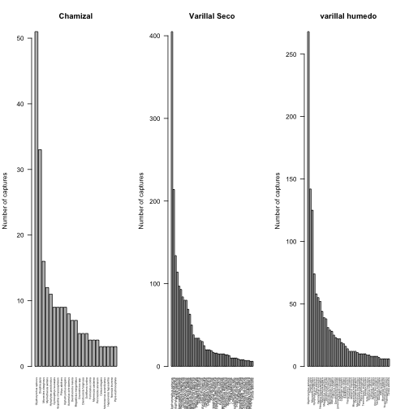

Bird captures
========================================================

author: Judit Ungvari-Martin  


Sampling Birds in Two Forest Types    

================================================


    - Western Amazonia

*******


Localities & Background
========================================================
- 22 months in the field
- mark/recapture of birds 
- 2 different habitat types

*******


Packages Used
========================================================


```r
library("knitr")
library("gdata")
library("vegan")
library("bipartite")
library("betapart")
library("reshape")
library("labdsv")
library("dplyr")
library("maps")
library("mapdata")
source("~/Dropbox/R resources/codes/pois_aov.R")
library("vegan")
library("maptools")
library("RColorBrewer")
library("mapplots")
library("maps")
library("mapdata")
library("scales")
```

Dataset
========================================================
- basically the raw data straight from the field notes

```r
complete = read.csv(file="data/complete.csv", header=TRUE)
(dim(complete))
```

```
[1] 8469   64
```

```r
names(complete)
```

```
 [1] "Net"              "Regist"           "anillador"       
 [4] "Codigo"           "No_anillo"        "No_anillo."      
 [7] "Anillo.color"     "Codigo.especie"   "FAMILY"          
[10] "Genus"            "species"          "spp"             
[13] "Edad"             "Codigo.fechado"   "SEXO..M.H.D."    
[16] "Codigo.Sexado"    "SEX.MOLEC"        "MUSCULO"         
[19] "PROCLO"           "PARINC"           "GRASA"           
[22] "MUDA.CORP"        "MUDA.VUEL"        "MUDA.COLA"       
[25] "DESG.VUEL"        "PLUMJUV"          "ALA"             
[28] "COLA"             "CULMEN"           "APERTURA"        
[31] "TARSO"            "PESO"             "COJO"            
[34] "CPIEL"            "CPATAS"           "ECTOPARASITO"    
[37] "SANGRE"           "H1"               "H2"              
[40] "H3"               "H4"               "RED"             
[43] "FECHA"            "Year.x"           "ECTO.ROJO"       
[46] "Dondectos"        "Cuantosectos"     "OBSERVACIONES"   
[49] "CREST"            "Specific.Habitat" "general.habitat" 
[52] "Field.Site"       "REGION"           "PATCH.SIZE"      
[55] "Netline"          "NetlineYEAR"      "Foragero"        
[58] "SAMPLE.NUMBER"    "Categories"       "lon"             
[61] "lat"              "ele"              "Net.number"      
[64] "Year.y"          
```

Dataset cleanup
========================================================


```r
complete = complete[!is.na(complete$Regist),] #removes 77 unused lat long NA rows
dim(complete)
```

```
[1] 8392   64
```

```r
summary(complete$lon)
```

```
   Min. 1st Qu.  Median    Mean 3rd Qu.    Max. 
 -73.56  -73.50  -73.44  -73.47  -73.43  -73.41 
```

```r
summary(complete$lat) #use the min and max values for map making
```

```
   Min. 1st Qu.  Median    Mean 3rd Qu.    Max. 
 -3.992  -3.950  -3.915  -3.926  -3.899  -3.876 
```

First glance
========================================================
- Make a list of all the species and sort them

```r
# Species rank curve dataset
(allsp = sort(table(complete$spp), decreasing = TRUE))
```


Rank curve for all captures
========================================================
 
Further cleanup
========================================================


- Calculate the average number of captures, mean,stdev of forest.net

```r
summary(forest.net)
```

```r
(capmeans <- mean(forest.net))
```

```
[1] 89.54839
```

```r
(capsd <- sd(forest.net))
```

```
[1] 29.16725
```
Create subsets of new captures, recaptures, repeated captures
========================================================
- Calculate number of captures per habitat

```
clay  wsf 
1564 5114 
```
- wsf stands for white sand forests 


Create subsets for habitats
========================================================
-- within sandy forests there are 3 subsets of habitats


  

Number of sites per species
=================================
 
- histogram of sorted data

Comparing capture rates with a t-test
=======

```

	Shapiro-Wilk normality test

data:  Captures
W = 0.9801, p-value = 0.1687
```

```
Habitat: clay
[1] 100.3684
-------------------------------------------------------- 
Habitat: wsf
[1] 86.77027
```

```
Habitat: clay
[1] 31.60557
-------------------------------------------------------- 
Habitat: wsf
[1] 28.06331
```

More histograms for number of captures
=======
 

More histograms for species
=======
 
- display legend using:

```r
legend("topright", c("Welch Two Sample t-test", 
                 "p-value = 0.01018"), cex=0.55)
```

Making maps
============
-map for some capture localities and species

-map of Northern South America first

```r
map("worldHires", xlim=c(-90,-30), ylim=c(-30,12), col="gray95", fill=TRUE)
```

 

Use rangemaps from IUCN
========
-there are shapefiles for all species
*******

 
Closely related species
=========
![neopelmas] (future.jpg)


*******
 

Questions?
=====

